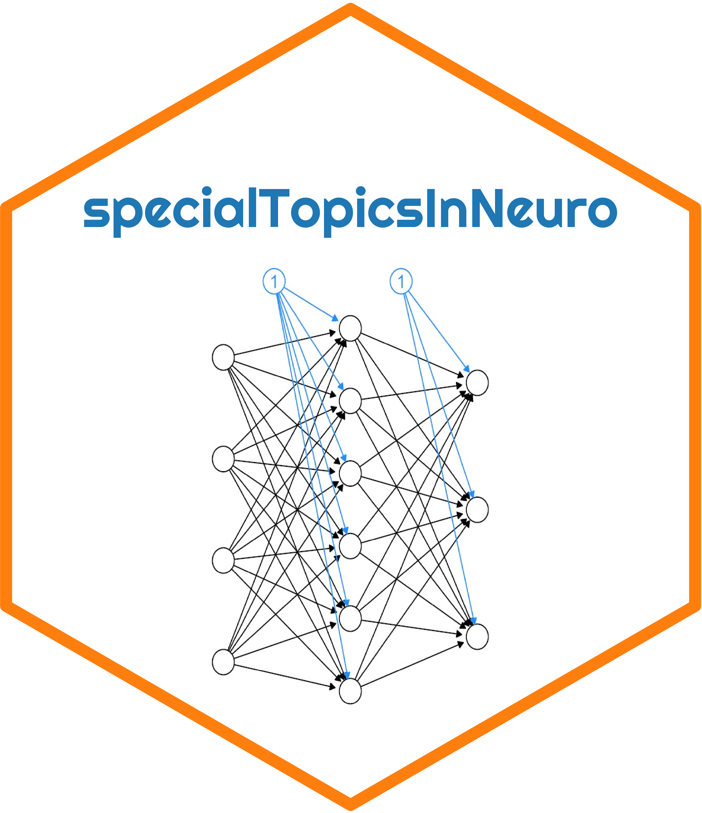

## From-scratch derivation of artifical neural network for simulated neuron activity classification

### Tentative Schedule

**Week 1. Biophysical and reduced neuronal models (6/2)**  
Tasks: Construct Izhikevich neuron model

**Week 2. Parameter search and optimization methodologies (6/8)**  
Tasks: Build random parameter search procedure

**Week 3. Iterative simulations in series and in parallel (6/15)**  
Tasks: Simulate large number of Izhikevich neuron models in spiking and
bursting activity regimes

**Week 4. Features of neural activity (6/22)**  
Tasks: Compute features of generated neural activity

**Week 5. Mathematics of artifical neural network (ANN) model (6/29)**  
Tasks: Derive mathematical model of ANN

**Week 6. Mathematics of ANN model supervised learning procedure
(7/6)**  
Tasks: Derive mathematical representation of supervised learning
procedure

**Week 7. Computational mathematics and linear algebra (7/13)**  
Tasks: Implement mathematical model of ANN computationally

**Week 8. Computational mathematics and linear algebra cont’d (7/20)**  
Tasks: Continue computational implementation of mathematical ANN model

**Week 9. EXTRA TIME (7/27)**

**Week 10. EXTRA TIME (8/3)**

**Week 11. EXTRA TIME (8/10)**
